**Redes de telecomunicaciones para IoT**

# **Control remoto de robots en Unity3D mediante ESP32 y WebSockets**

**Jonathan David Aguilar Betancourth**

**Ingeniero en Automática Industrial**

**2025**

Este proyecto busca integrar un robot UR3 simulado en Unity 3D con el Internet de las Cosas (IoT), permitiendo controlar el robot desde una interfaz web. Para ello, se utiliza una ESP32 como puente de comunicación entre Unity (vía TCP) y una página web, haciendo uso de un servidor WebSocket. De esta manera, los comandos enviados desde la interfaz web se transmiten en tiempo real hasta el robot simulado.

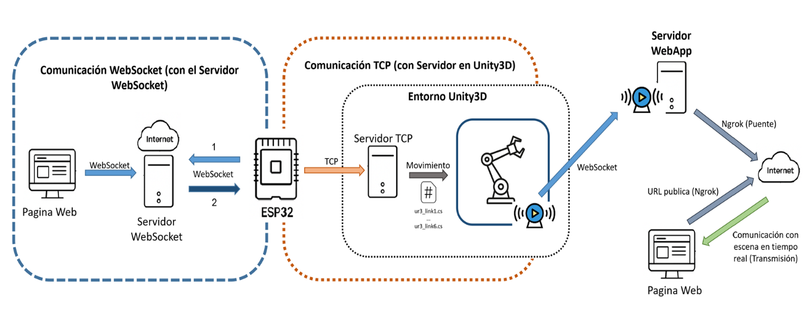

# **1\. Requisitos Iniciales y Descarga del Proyecto Base**

El primer paso para comenzar con el desarrollo de este trabajo, es descargar el Archivo.zip del proyecto base de Unity 3D que contiene la simulación del robot UR3. Este proyecto está disponible en el siguiente repositorio de GitHub:

🔗 <https://github.com/rparak/Unity3D_Robotics_UR>

Una vez descargado, descomprime el archivo Unity3D_Robotics_UR-main.zip.

Además, es necesario contar con las siguientes herramientas instaladas en el sistema:

- Unity 3D (versión recomendada: 2022.3.2f1 o similar)
- Paquete Unity HDRI Pack (para mejorar la iluminación y entorno del proyecto)
- Visual Studio (2017/2019 o superior, como editor de código para C# en Unity)
- Blender (para edición y visualización de modelos 3D)

Con estos elementos preparados, se puede abrir el proyecto “Unity3D_Robotics_UR-main” en Unity y comenzar con su configuración e integración con el resto de componentes del sistema.

# **2\. Construcción de Servidor WebSocket**

Para la construcción del servidor WebSocket, instalar la aplicación **Node.js**, para eso ingresa a <https://nodejs.org/es>, luego da clic en **Get Node.js** y finalmente clic en **Windows Installer (.msi)**, se descargará el archivo _“node-v22.17.0-x64”_, dar doble clic en instala.

**2.1 Archivo (sever.js):**

Abre Visual Studio Code, crea un archivo nuevo y copia las siguientes líneas de código. Primero, se importa la librería **ws**, que es un módulo externo de Node.js. Este módulo permite crear servidores y clientes WebSocket en Node.js. Luego se crea un servidor WebSocket que escucha en el puerto 8080.

const WebSocket = require('ws');

const wss = new WebSocket.Server({ port: 8080 });

Posteriormente, se define una variable global esp32 para guardar la conexión WebSocket correspondiente al dispositivo ESP32 cuando este se conecte, es decir, es una variable para registrar la ESP32 para que solo ella reciba mensajes del servidor Websocket solo si desde la ESP32 se envía hacia el servidor el mensaje “esp32”.

let esp32 = null;

Luego, cada vez que un cliente como la Página web o la ESP32 se conecta al servidor, se ejecuta la función **connection**. **ws** representa la conexión del cliente, y se imprime en consola del servidor ("Nueva conexion WebSocket").

wss.on('connection', function connection(ws) {

&nbsp;   console.log("Nueva conexion WebSocket");

Lo siguiente, escucha los mensajes que llegan desde el cliente conectado al servidor WebSocket. Cada vez que ese cliente envía un mensaje, se ejecuta la función **incoming** y en consola se imprime el mensaje entrante.

ws.on('message', function incoming(message) {

&nbsp;       console.log("Mensaje recibido:", message.toString());

Este if detecta si el mensaje recibido es exactamente "**esp32**". Si es así, guarda el socket actual (ws) en una variable llamada esp32 e imprime ESP32 registrada en la consola. Esto permite identificar que este cliente es el dispositivo ESP32 (no la interfaz web), y guardar su socket para luego enviarle mensajes directamente.

if (message.toString() === 'ID') {

&nbsp;           esp32 = ws;

&nbsp;           console.log("ESP32 registrada");

&nbsp;           return;

&nbsp;       }

Después se verifica si ya se registró un ESP32 (esp32 no es null) y si está conectado. Si es así, reenvía el mensaje recibido. Esto permite que otros clientes puedan enviar mensajes al ESP32 a través del servidor, como un puente o intermediario. Pero si no hay una esp32 conectada, se evalúa como falso, y el bloque esp32.send(...) no se ejecuta lo que significa que No se envía el mensaje.

// Redirige al ESP32

&nbsp;       if (esp32 && esp32.readyState === WebSocket.OPEN) {

&nbsp;           esp32.send(message.toString()); }

Finalmente, este bloque escucha el evento **'close'**, que ocurre cuando un cliente se desconecta del servidor WebSocket. Verifica si el cliente que se desconectó (ws) es el mismo que teníamos registrado como la ESP32. Si el cliente era la ESP32, se borra esa referencia, es decir, ya no se tiene la ESP32 conectada y se muestra en consola que la ESP32 se desconectó.

ws.on('close', function () {

&nbsp;       if (ws === esp32) {

&nbsp;           esp32 = null;

&nbsp;           console.log("ESP32 desconectada");

&nbsp;       }

&nbsp;   }); });

console.log("Servidor WebSocket corriendo");

Para observar en consola los mensajes de los eventos y funciones que contiene este servidor Websocket, realice todos los pasos siguientes hasta completar **2.5 Deploy (despliegue) del Servidor WebSocket,** una vez realice cada paso, ingrese a Render y abra el servidor desplegado, en la parte izquierda sección MONITOR subsección Logs podrá observar los mensajes que imprime el servidor. **Ver código Servidor Websocket en Sección código fuente.**

posteriormente, crea una carpeta llamada (**servidor-ws**) y guarda ese archivo con el nombre de server. Este archivo **_“server.js_”** será el servidor WebSocket para comunicación entre la página web y la ESP32.

**2.3 Configuración y ejecución del servidor WebSocket:**

Abre el terminal (cmd) e ingresa a la carpeta llamada servidor-ws la cual contiene el archivo sever.js, una vez ubicado en ese directorio, ejecuta los siguientes tres comandos uno por uno:

- **npm init -y**
- **npm install ws**
- **node server.js**

Ejecución de comandos:

- Comando **npm init -y**

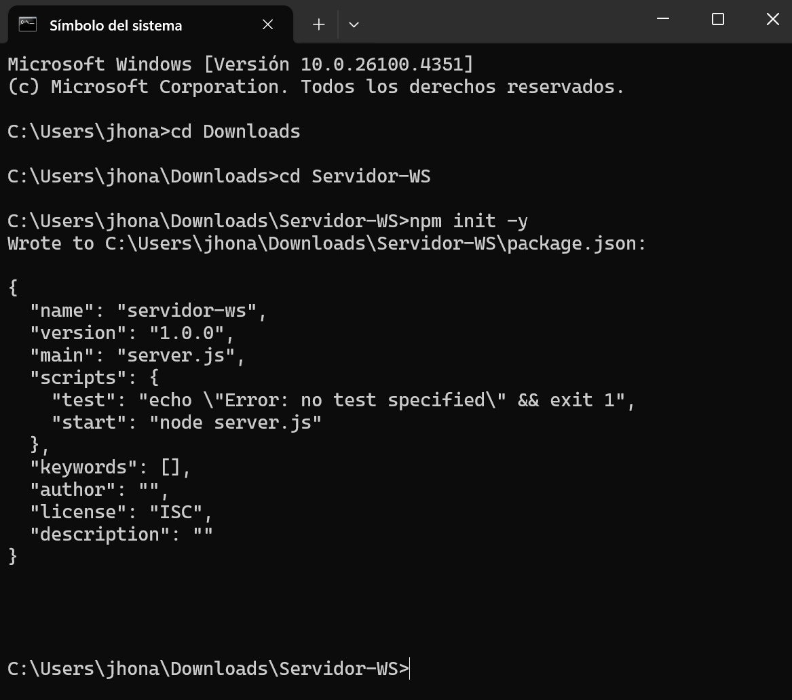

- Comando **npm install ws**

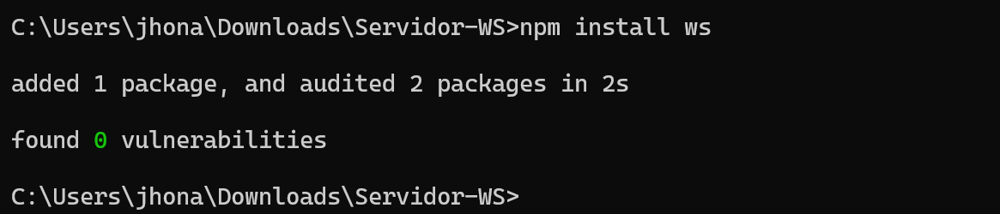

- Comando **node server.js**

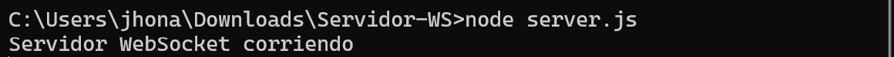

Una vez realizado lo anterior, en el directorio servidor-ws que contiene el archivo server.js, debe haberse creado tres archivos como se observa en la imagen:

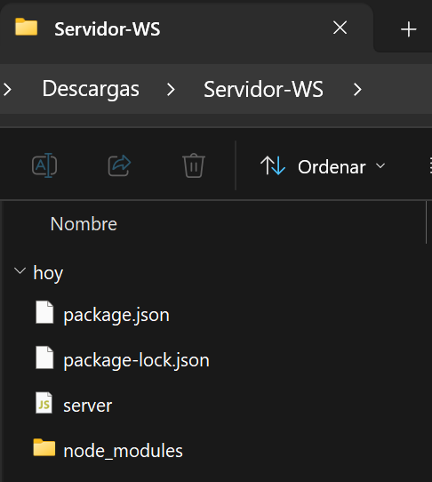

Posteriormente, abre nuevamente Visual Studio Code, crea un archivo nuevo y copia siguiente script:

services:

&nbsp; - type: web

&nbsp;   name: servidor-websocket

&nbsp;   env: node

&nbsp;   plan: free

&nbsp;   buildCommand: ""

&nbsp;   startCommand: node server.js

&nbsp;   envVars: \[\]

Guarda ese archivo con el nombre de render en la carpeta servidor-ws, se creará un archivo “render.yaml”. Esto le dice a Render que es una plataforma de alojamiento en la nube cómo ejecutar el servidor para que se realice el proceso de despliegue en la nube, es decir, automatiza todo el proceso de Deploy.

**2.4 Subir Websocket a GitHub.**

Abrir una cuenta en GitHub <https://github.com/join>, si ya cuentas con una, crea un nuevo repositorio llamado **servidor-ws**. Luego, abre terminal (cmd) e ingresa a la carpeta llamada servidor-ws en la cual se realizó la **configuración y ejecución del servidor WebSocket,** paso siguiente, ejecuta los siguientes comandos uno por uno:

- **git init**
- **git add .**
- **git commit -m "Subida inicial"**
- **git branch -M main**
- **git remote add origin <https://github.com/TU_USUARIO/servidor-ws.git>**
- **git push -u origin main**

Cuando ejecutes cada uno de los comandos debes observar los siguientes resultados:

- **git init**

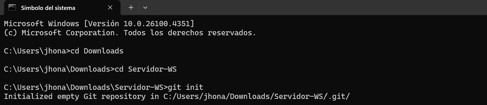

- **git add .**

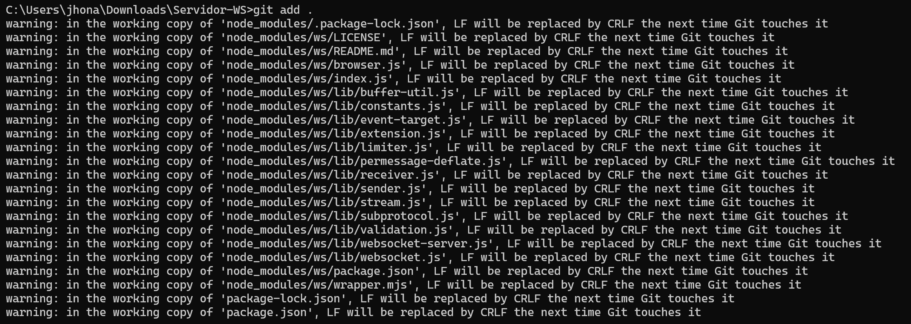

- **git commit -m "Subida inicial"**

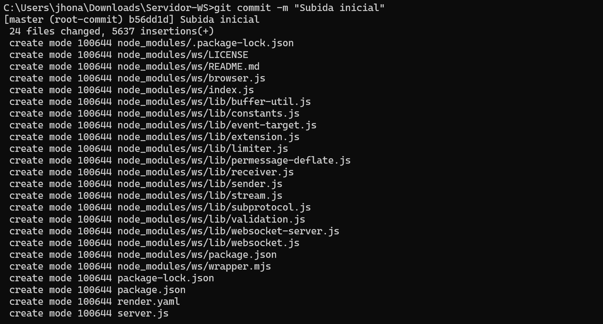

- **git branch -M main**
- **git remote add origin <https://github.com/TU_USUARIO/servidor-ws.git>**
- **git push -u origin main**

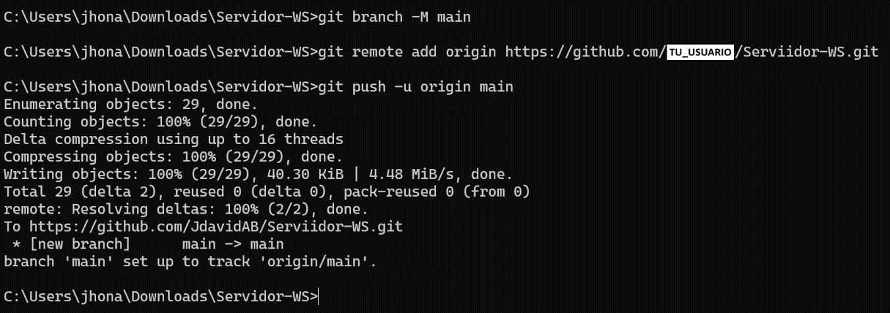

Realizado lo anterior, se podrá observar en tu repositorio **servidor-ws** de GitHub la copia del servidor Websocket, y en el directorio de tu PC llamado servidor-ws, se observará una Carpeta de archivos (.git)

**2.5 Deploy (despliegue) del Servidor WebSocket**

El objetivo de este despliegue, es exponer el servido websocket a la red globa de internet, necesario para que la página web que es publica desde cualquier red pueda acceder al dispositivo ESP32.

Para eso, se utilizará Render que es una plataforma de alojamiento en la nube que permite:

- Desplegar aplicaciones web, APIs, servidores, WebSockets, bases de datos, etc.
- Tener servidores backend corriendo 24/7 en Internet.
- Evitar tener que configurar tu propio servidor físico o VPS.
- Tener un dominio público accesible (como <https://tu-api.onrender.com>).

Primero inicia sesión en Render <https://render.com/> con la cuenta de GitHub creada anteriormente. Da clic en el botón **“+ New”** y posteriormente en **Web Service**, autoriza a Render para ver tus repositorios, si te lo pide y finalmente, selecciona tu repositorio de GitHub **servidor-ws**. Realizado lo anterior, completa los siguientes datos:

| **Campo** | **Valor** |
| --- | --- |
| **Name** | servidor-websocket |
| **Branch** | main |
| **Build Command** | echo "skip build" |
| **Start Command** | node server.js |
| **Plan** | Free |

Luego se da clic en **Deploy Web Service** y espera el despliegue, Render va a: Clonar tu repositorio, instalar dependencias (ws) y ejecutar node server.js.

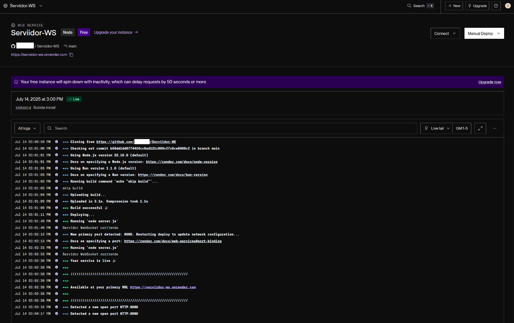

Finalmente, el servidor WebSocket quedara desplegado públicamente en Render con la URL publica <https://serviidor-ws.onrender.com>, esta se usará para que la página web como la ESP32 puedan acceder a ese servidor como clientes y con ello establecer una comunicación bidireccional entre Página web – servidor Websocket – ESP32; al dar clic en la URL se debe abrir una página en el navegador que muestre el siguiente mensaje **“Upgrade Required”** lo cual quiere decir que el servidor fue desplegado correctamente.

# **3\. Interfaz Web: Acceso publico**

En esta sección se explica el paso a paso para la creación de una Interfaz web que se comunica con el servidor Websocket y su posterior despliegue en Render para obtener un acceso público de esta.

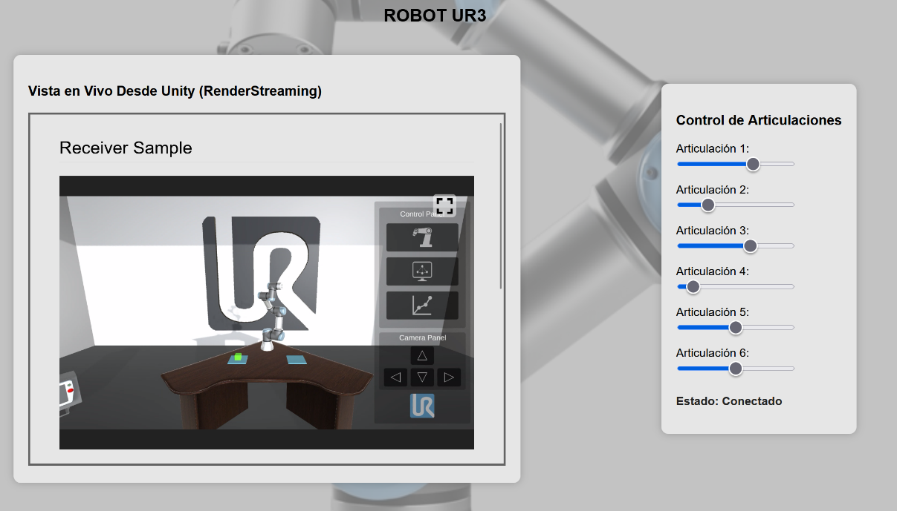

**3.1 Slider (articulaciones Robot UR3):**

Ahora, se construye las pagina web. Abrir Visual Studio Code y crear un nuevo archivo en el cual se va a copiar el siguiente script:

&lt;div class="control-box"&gt;

&nbsp;     &lt;h3&gt;Control de Articulaciones&lt;/h3&gt;

&nbsp;     &lt;label&gt;Articulación 1:&lt;/label&gt;

&nbsp;     &lt;input type="range" id="slider1" min="-180" max="180" value="0" oninput="sendJoint(1, this.value)"&gt;&lt;br&gt;

&nbsp;     &lt;p id="status"&gt;Estado: Desconectado&lt;/p&gt;

&nbsp;   &lt;/div&gt;

Lo anterior permite crear 6 slider cada uno correspondiente a cada articulación de las 6 articulaciones de robot UR3, además, se estable el rango de movimiento que va entre (-180 a 180) grados para cada articulación. Como resultado se obtiene lo siguiente:

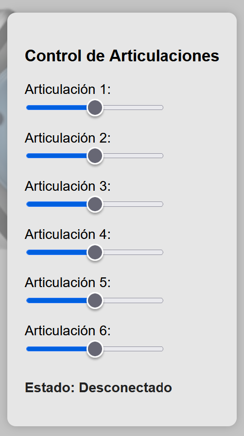

**3.2 Conexión con el Servidor Websocket**

Las siguientes líneas de código, establecen la conexión de la Pagina web con el servidor WebSocket utilizando la URL que se obtuvo del **despliegue del Servidor WebSocket.**

&lt;script&gt;

&nbsp;   let socket = new WebSocket("wss://servidor.onrender.com");

Luego, el evento **onopen**, muestra el estado de conexión en pantalla. Este bloque se ejecuta cuando la conexión se abre exitosamente y cambia el texto del elemento con id="status" en el HTML, mostrando "Estado: Conectado" e imprime en consola que la conexión fue exitosa ("Conectado a WebSocket")

socket.onopen = function() {

&nbsp;     document.getElementById("status").innerText = "Estado: Conectado";

&nbsp;     console.log("Conectado a WebSocket"); };

El evento **onmessage**, imprime los mensajes que recibe desde el servidor, es decir, este evento se ejecuta cada vez que el servidor envía un mensaje al cliente. En este caso el evento esta sin uso ya que el servidor websocket no envía un mensaje hacia la página web. Sin embargo, al igual que el anterior evento de existir mensaje este se imprime en la consola.

socket.onmessage = function(event) {

&nbsp;     console.log("Mensaje recibido:", event.data); };

Finalmente, las siguientes líneas de código permiten enviar comandos hacia el servidor usando la función **sendJoint**. Crea un mensaje como J1:90 (por ejemplo, si quieres mover la articulación 1 a 90 grados). Antes de enviar información, verifica que la conexión esté abierta con socket.readyState === WebSocket.OPEN, de no tener una conexión abierta se imprime en la consola ("WebSocket no esta conectado")

&nbsp;   function sendJoint(jointNumber, value) {

&nbsp;     const message = \`J${jointNumber}:${value}\`;

&nbsp;     if (socket.readyState === WebSocket.OPEN) {

&nbsp;       socket.send(message);

&nbsp;       console.log("Enviado:", message);

&nbsp;     } else {

&nbsp;       console.log("WebSocket no esta conectado"); }

Para observar en consola los mensajes de los eventos y la función que contienen esta página web, abra la interfaz o página web y en ella presione Ctrl + Shift + I. **Ver código Página web HTML en Sección código fuente.**

posteriormente, crea una carpeta llamada (**interfazwebservidor**) y guarda ese archivo con el nombre de index. Este archivo **_“index.html_”** será la página web que se comunicará con el servidor WebSocket.

**3.3 Subir Pagina web a GitHub.**

Crea un nuevo repositorio en GitHub llamado **interfaz**. Luego, ingresa a este repositorio y da clic en **“uploading an existing file”**, En la página que se abre, arrastra tu archivo index.html o haz clic en **"choose your files"** y selecciónalo. Una vez realizado lo anterior, haz clic en **“Commit changes”**. Podrás ver en tu repositorio **interfaz** el documento **index.html**.

**3.4 Deploy (despliegue) de la Página Web**

El objetivo de este despliegue, es exponer la página web a la red globa de internet, necesario para que la página web sea publica desde cualquier red y se pueda acceder a ella sin ningún problema.

Para eso, se utilizará Render que es una plataforma de alojamiento en la nube. Primero inicia sesión en Render <https://render.com/> con la cuenta de GitHub. Da clic en el botón **“+ Add new”** y posteriormente en **Static Site**, autoriza a Render para ver tus repositorios, si te lo pide y finalmente, selecciona tu repositorio de GitHub **interfaz**. Realizado lo anterior, completa los siguientes datos:

| **Campo** | **Valor** |
| --- | --- |
| **Name** | Interfaz-UR3 |
| **Branch** | main |
| **Build Command** | echo "skip build" |
| **Publish Directory** | .   |
| **Plan** | Free |

Luego se da clic en **Deploy Static Site** y espera el despliegue, Render va a: Clonar tu repositorio.

Finalmente, la Página web quedara desplegada públicamente en Render con la URL publica <https://interface-ur3.onrender.com>, al dar clic en la URL se debe abrir una página en el navegador que muestre la interfaz web con los Sliders para controlar las articulaciones del robot UR3 lo cual quiere decir que el servidor fue desplegado correctamente.

# **4\. Configuración del Dispositivo ESP32**

Descarga Arduino IDE desde <https://www.arduino.cc/en/software/>, e instala.

- Una vez realizado lo anterior, instala el soporte para ESP32. Abre Arduino IDE y ve a Archivo > Preferencias. En "Gestor de URLs adicionales para tarjetas", agrega esta URL: <https://raw.githubusercontent.com/espressif/arduino-esp32/gh-pages/package_esp32_index.json>, y clic en Aceptar.
- Selecciona la placa ESP32. Ve a Herramientas > Placa > Gestor de tarjetas, busca "ESP32" e instala el paquete de **Espressif Systems**. Luego, selecciona tu modelo de ESP32 en Herramientas > Placa > esp32 y busca **ESP32 Dev Module** y selecciónalo.
- Selecciona el puerto correcto, conecta el dispositivo ESP32, ve a Herramientas > Puerto y selecciona el puerto donde está la ESP32 (ejemplo: COM3, COM4).

Realizado lo anterior, ya se puede crear código en Arduino IDE, una vez se cree algún código, da clic en Verificar para comprobar errores y clic en Subir para cargarlo al ESP32.

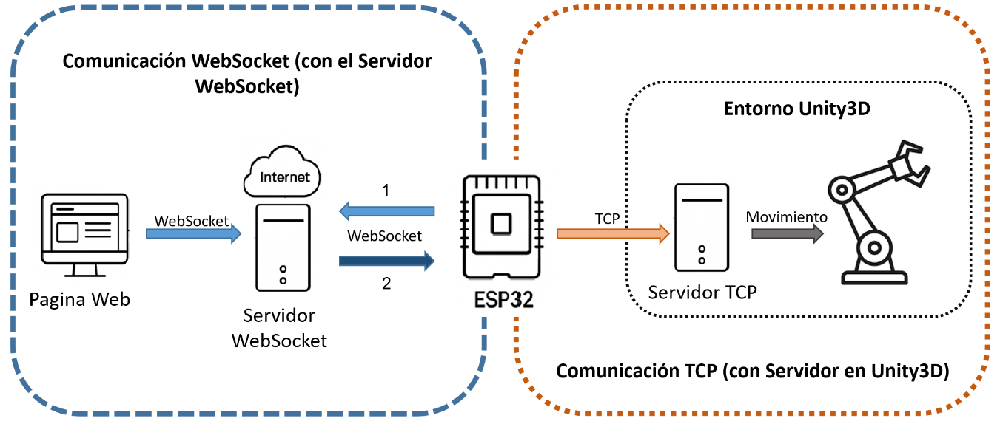

**4.1 Comunicación WebSocket (con el Servidor WebSocket)**

Importa la librería que permite usar WebSocket en la ESP32 como cliente. Sin esta librería, la ESP32 no sabría cómo conectarse ni comunicarse con un servidor WebSocket.

include &lt;WebSocketsClient.h&gt;

Luego, crea un objeto llamado **webSocket**, que representa la conexión con el servidor WebSocket. Este objeto se usa para:

- Conectarte al servidor (webSocket.beginSSL(...))
- Enviar mensajes (webSocket.sendTXT(...))
- Recibir eventos y mensajes (webSocket.onEvent(...))
- Procesar todo en loop() (webSocket.loop())

// Cliente WebSocket\*\*\*\*

WebSocketsClient webSocket;

Posteriormente, la función de eventos WebSocket **webSocketEvent**, maneja los eventos que ocurren entre la comunicación con el Servidor WebSocket.

| **WStype_DISCONNECTED** | Cuando la conexión se pierde o se cierra, ya sea por el servidor, por fallos de red, o por reinicio de la ESP32. |
| --- | --- |
| **WStype_CONNECTED** | Cuando la ESP32 logra establecer conexión exitosa con el servidor WebSocket. |
| **WStype_TEXT** | Cuando el servidor WebSocket envía un mensaje de texto a la ESP32. |
| **WStype_ERROR** | Si ocurre un error en la conexión, protocolo o comunicación. |

// Evento WebSocket

void webSocketEvent( WStype_t type, uint8_t \* payload, size_t length)

{

&nbsp; switch (type)

&nbsp; {

&nbsp;   case WStype_DISCONNECTED:

&nbsp;     Serial.println("Desconectado del WebSocket");

&nbsp;     break;

&nbsp;   case WStype_CONNECTED:

&nbsp;     Serial.println("ESP32 conectado exitosamente al ((WebSocket))");

&nbsp;     // Esto registra la ESP32 en el servidor

&nbsp;     webSocket.sendTXT("ID");  

&nbsp;     break;

&nbsp;   case WStype_TEXT:

&nbsp;   {

&nbsp;     String message = String((char\*)payload);

&nbsp;     message.trim();  // Eliminar espacios en blanco o caracteres extraños

&nbsp;     Serial.println("Mensaje recibido en ESP32 desde servidor: " + message);

&nbsp;     // UNITY - Aquí se lo enviamos a Unity

&nbsp;     sendToUnity(message);

&nbsp;     break;

&nbsp;   }

&nbsp;   case WStype_ERROR:

&nbsp;     Serial.println("Error en WebSocket");

&nbsp;     break;

&nbsp;   default:

&nbsp;     break;

&nbsp; } }

Luego, se establece una conexión segura (WSS) con el servidor WebSocket desplegado en Render. "**servidor.onrender.com**", es la dirección del servidor WebSocket; **443**, es el puerto estándar para HTTPS/WSS y **"/"**, es la ruta del endpoint, por defecto es raíz.

**webSocket.onEvent**, le está diciendo a la ESP32 que cuando ocurra algo (conexión, desconexión, mensaje recibido, error), se ejecute la función **webSocketEvent(...)**.

**webSocket.setReconnectInterval**, es usada para que cuando la ESP32 se desconecte del servidor, intente reconectarse cada 1000 ms (1 segundo).

void setup() {

&nbsp;   // Conectarse al servidor WebSocket en Render (SSL/WSS)\*\*\*\*

&nbsp;   webSocket.beginSSL("servidor.onrender.com", 443, "/");

&nbsp;   webSocket.onEvent(webSocketEvent);

&nbsp;   // Reintentar cada 1 segundos\*\*\*\*

&nbsp;   webSocket.setReconnectInterval(1000);  }

Finalmente, **loop()** es usado para mantener activa la conexión WebSocket y con ello permitir que se escuchen y procesen mensajes.

void loop(){
&nbsp;   webSocket.loop(); }

**4.2 Comunicación TCP** (**con servidor en Unity3D)**

Inclusión de la librería **WiFiClient**, esta librería proporciona todo lo necesario para que la ESP32 se comporte como cliente TCP.

include &lt;WiFiClient.h&gt;

Luego se define el cliente TCP, se crea un objeto **client** que representa la conexión TCP con Unity. Este objeto se usa para:

- Establecer la conexión (client.connect(...))
- Enviar datos (client.print(...))
- Cerrar la conexión (client.stop())

// UNITY - TCP cliente

WiFiClient client;

Posteriormente, se define la IP y puerto de Unity3D. unity_ip, es la dirección IP local del PC donde está corriendo el servidor TCP de Unity; unity_port, es el puerto que Unity está usando para escuchar conexiones TCP. La ESP32 usará esta IP y puerto para conectarse al servidor de Unity y enviarle datos.

// UNITY - Dirección IP del PC con Unity corriendo el servidor TCP

const char\* unity_ip = "192.168.2.###"; //¡CAMBIAR por IP local del PC!

const uint16_t unity_port = 8090;

Luego, se define la función **sendToUnity** para enviar mensaje a Unity, client.connect(...), intenta conectarse al servidor TCP (Unity). Si se estable la conexión se imprime el mensaje que va a enviar a unity3d; client.print(message), envía el mensaje al servidor TCP (Unity) y por último, client.stop(), cierra la conexión después de enviar (conexión temporal).

// UNITY - Función para enviar mensaje a Unity por TCP

void sendToUnity(String message)

{

&nbsp; if (client.connect(unity_ip, unity_port))

&nbsp; {

&nbsp;   Serial.println("Enviando a Unity: " + message);

&nbsp;   client.print(message);

&nbsp;   client.stop();  // Cerramos después de enviar

&nbsp;   Serial.println("Mensaje enviado a Unity");

&nbsp; } else

&nbsp; {

&nbsp;   Serial.println("No se pudo conectar a Unity");

&nbsp;  

&nbsp;   if (!client.connect(unity_ip, unity_port))

&nbsp;   {

&nbsp;   Serial.print("No se pudo conectar a Unity en IP: ");

&nbsp;   Serial.print(unity_ip);

&nbsp;   Serial.print(", puerto: ");

&nbsp;   Serial.println(unity_port);

&nbsp;   return;

&nbsp;   }

&nbsp; } }

Finalmente, cuando llega un mensaje desde el servidor WebSocket (desde una página web -> servidor WebSocket), ese mensaje se convierte en texto y se imprime y luego se envía a Unity a través de TCP usando la función sendToUnity() que explicamos arriba.

case WStype_TEXT:

&nbsp;   {

&nbsp;     String message = String((char\*)payload);

&nbsp;     message.trim();  // Eliminar espacios en blanco o caracteres extraños

&nbsp;     Serial.println("Mensaje recibido en ESP32 desde servidor: " + message);

&nbsp;     // UNITY - Aquí se lo enviamos a Unity

&nbsp;     sendToUnity(message);

&nbsp;     break;

&nbsp;   }

Para observar en consola los mensajes de comunicación de la ESP32 con el servidor WebSocket y el servidor TCP de Unity3d, abra Arduino IDE vaya a Herramientas > Monitor Serie. **Ver código ESP32 en Sección código fuente.**

Crea un archivo nuevo en Arduino IDE, copia el código y guarda ese archivo con el nombre de esp32websocketservidor y luego cargue el código en el dispositivo ESP32. Este archivo **_“esp32websocketservidor.ino_”** permitirá que la ESP32 se comunique con el servidor WebSocket y con el servidor TCP de Uniry3D.

# **5\. Configuración del entorno de Unity3D**

Abre el Proyecto Base de Unity3D, en la ventana de Assets busca la carpeta **Scripts** dentro de esta crea un nuevo script, para eso presión clic derecho sobre la carpeta **Scritps** y selecciona **Create** y luego **C# Script**. A este nuevo script nómbralo como **TCPServer**.

**5.1 Construcción de servidor TCP**

Iniciamos usando o importando estas librerías necesarias:

- **System.Net, System.Net.Sockets**: para trabajar con IP/TCP.
- **System.Text**: para codificar y decodificar los mensajes que llegan como bytes.
- **System.Threading**: para correr el servidor en un hilo aparte.
- **UnityEngine**: para que funcione dentro de Unity.

Definimos dos variables:

- **server** del tipo **TcpListener**: objeto que va a escuchar conexiones TCP en un puerto. TcpListener, es una clase que permite crear un servidor TCP, es decir, escucha conexiones entrantes desde clientes (como la ESP32).
- **serverThread** del tipo **Thread**: hilo de ejecución independiente. Se usa para que el servidor TCP pueda correr en segundo plano sin bloquear el resto del juego (como la interfaz o los movimientos de objetos en Unity).

Posteriormente, se define el método **void Start()** que se ejecuta una sola vez cuando se da inicia al proyecto. Entonces al iniciar Unity, se crea un nuevo hilo que llama a **StartListening()**. Esto evita que Unity se "congele" mientras espera conexiones TCP.

void Start()

{

serverThread = new Thread(StartListening);

serverThread.Start();

}

El método **void StartListening()**, crea el servidor TCP (TcpListener) y permite escuchar o recibir conexión de clientes. Es decir, IPAddress.Any, escucha desde cualquier IP (por ejemplo, desde la ESP32); 8090, es el puerto TCP en el que el servidor escucha y server.Start() activa el servidor TCP.

void StartListening()

{

server = new TcpListener(IPAddress.Any, 8090);

server.Start();

Debug.Log("Servidor TCP en Unity esperando conexión...");

Luego se establece un bucle que se ejecutará una y otra vez sin parar, este patrón se usa para esperar conexiones continuamente, como lo hace un servidor para que siempre este escuchando nuevas conexiones. **server.AcceptTcpClient()** espera hasta que alguien se conecte y cuando eso ocurre, se acepta la conexión y se crea un objeto **client** para comunicarse con ese cliente específico. Luego se imprime: "Cliente conectado desde ESP32".

while (true)

{

TcpClient client = server.AcceptTcpClient();

Debug.Log("Cliente conectado desde ESP32");

Luego se crea una variable llamada **stream**, que es del tipo NetworkStream (una tubería de red), y esa tubería es la que obtengo de **client.GetStream()** que solo da acceso a ese canal de datos ya existente por donde se enviarán y recibirán los datos.

NetworkStream stream = client.GetStream();

Se crea un array **buffer** del mismo tamaño que el buffer del socket, para asegurarnos de que podemos recibir todo el mensaje sin cortar datos, es decir, guardar temporalmente los datos que llegan desde la ESP32 por TCP. Luego, **stream.Read(buffer, 0, buffer.Length)** lee los datos del socket TCP que se obtuvo con **client.GetStream()** (lo que mandó la ESP32).

| **buffer** | El arreglo donde se van a guardar los datos que llegaron. |
| --- | --- |
| **0** | Es la posición dentro del arreglo buffer donde quieres empezar a guardar los datos. En este caso, desde el inicio del arreglo. |
| **buffer.Length** | Es la cantidad máxima de bytes que quieres leer. En este caso, todo el arreglo. |

**bytesRead** es la variable que contiene el número real de bytes que se leyeron desde el canal stream.

byte\[\] buffer = new byte\[client.ReceiveBufferSize\];

int bytesRead = stream.Read(buffer, 0, buffer.Length);

Luego, se convierte los bytes recibidos a un string usando codificación ASCII, para obtener un texto legible. Toma la parte útil del buffer (es decir, solo los datos que realmente se recibieron), comenzando desde la posición 0 y utilizando únicamente la cantidad de bytes que llegaron, según lo indicado por bytesRead.

string message = Encoding.ASCII.GetString(buffer, 0, bytesRead);

Finalmente, se llama al método **ProcessMessage(message)**. En este método procesa el mensaje recibido desde la ESP32 (por conexión TCP). Analiza el comando relacionado con movimiento de articulaciones del brazo robótico en Unity (por ejemplo: J1:45.0).

**ProcessMessage()**

Se define el método que recibe como parámetro el mensaje (message).

void ProcessMessage(string message)

Luego, se eliminan los espacios en blanco al inicio o al final del mensaje, si los hay, por ejemplo: si llega " J1:45.0 " queda "J1:45.0".

message = message.Trim();

Se verifica si el mensaje comienza con la letra "J". Si es así, se interpreta como un comando para mover una articulación (J1, J2, etc).

if (message.StartsWith("J"))

Posteriormente, se extrae la parte que está después de la J y se divide en 2 partes usando el carácter “**:**”.

Por ejemplo:

Si se tiene "J1:45.0" -- **Substring(1)** -- "1:45.0"

Luego, **Split(':')** hace que el mensaje quede \["1", "45.0"\] y se almacene en **parts**.

string\[\] parts = message.Substring(1).Split(':');

Luego, se debe asegurar que la variable **parts** este dividida en exactamente 2 partes. Además, que la primera parte, parts\[0\] que es un string se convierta a un entero (int) y se que se almacene en (**jointIndex**); y la segunda parte, parts\[1\] que también es un string se convierta es un número decimal (float) y se almacene en (**angle**).

Por ejemplo:

**parts\[0\] = "1"** pasa a **jointIndex = 1**

**parts\[1\] = "45.0"** pasa a **angle = 45.0**

if (parts.Length == 2 &&

int.TryParse(parts\[0\], out int jointIndex) &&

float.TryParse(parts\[1\], out float angle))

Paso siguiente, se convierte el índice de articulación (**jointIndex**) para que empiece en 0 en lugar de 1, porque los arreglos comienzan desde 0.

jointIndex -= 1; // J1 → índice 0

Finalmente, se Llama al método **SetJointAngle()** que está dentro de la clase publica **UR3JointController** de la siguiente manera, UR3JointController.SetJointAngle(jointIndex, angle); que se usa para actualizar el ángulo de la articulación correspondiente. **Ver código TCPServer en Sección código fuente.**

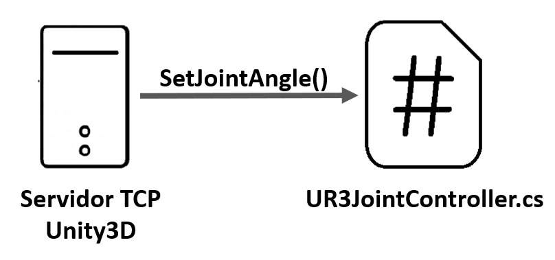

Este archivo **_“TCPServer.cs_”** de unity3D, será el servidor al cual se comunicará el dispositivo ESP33.

**5.2 Construcción Clases UR3JointController**

El propósito de esta clase, es almacenar y dar acceso a los ángulos de las 6 articulaciones (J1 a J6), para que otras partes del código (como los scripts ur3_link1, ur3_link2, etc.) puedan saber a qué ángulo rotar

En la ventana de **Assets** busca la carpeta **Scripts** dentro de esta crea un nuevo script, para eso presión clic derecho sobre la carpeta **Scritps** y selecciona **Create** y luego **C# Script**. A este nuevo script nómbralo como **UR3JointController**.

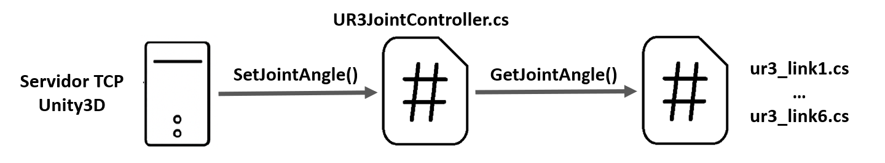

Primero se crea un arreglo de 6 valores decimales (float) que representan los ángulos de las 6 articulaciones del robot:

- jointAngles\[0\] = J1
- jointAngles\[1\] = J2
- ...
- jointAngles\[5\] = J6

Como es static, el arreglo se puede usar sin crear una instancia de la clase.

public static float\[\] jointAngles = new float\[6\];

**Método: public static void SetJointAngle(int index, float angle)**

Este método se usa para actualizar el ángulo de una articulación.

Por ejemplo, J1:45.0:

1. Se interpreta que J1 → índice 0, y el ángulo es 45.0.
2. Desde TCPServer se llama: SetJointAngle(0, 45.0);

Dentro de este método, se verifica si el index está en un rango entre 0 y 5, de ser así, se guarda 45.0 en jointAngles\[0\].

public static void SetJointAngle(int index, float angle)

{

if (index >= 0 && index < 6)

{

jointAngles\[index\] = angle;

}

**}**

**Método: public static float GetJointAngle(int index)**

Este método permite a otros scripts (como ur3_link1) consultar el ángulo actual de una articulación.

Por ejemplo, J1:45.0:

1. Se interpreta que J1 → índice 0, y el ángulo es 45.0.
2. Como se llamó a SetJointAngle(0, 45.0) y almaceno un ángulo de 45.0 en jointAngles\[0\]
3. Desde ur3_link1 Se llama: GetJointAngle(0);

El método recibe el valor de index (es decir la articulación) y retorna el valor del ángulo que se almaceno en jointAngles\[index\], que en esta caso es 45.0 para la articulación J1

public static float GetJointAngle(int index)

{

return jointAngles\[index\];

}

Este archivo **“UR3JointController.cs”** de unity3D, almacenará y dará acceso a los ángulos de las 6 articulaciones para el control del robot UR3. **Ver código TCPServer en Sección código fuente.**

**5.3 modificación de las Clases ur3_link1 … ur3_link6**

Estas clases, controlan la rotación visual de las 6 articulaciones del brazo robótico UR3 en Unity. La modificación que se realizara es para en función del ángulo que se recibía desde el ESP32 (a través de UR3JointController) se pueda ejecutar ese control de movimiento.

En la ventana de **Assets** busca la carpeta **Scripts** dentro de esta busca la carpeta **UR3** e ingresa, en esta encontraras otra carpeta llamada **Link** donde observaras 6 script **ur3_link1, …, ur3_link6**. Cada script está asignado al GameObject que representa cada articulación del brazo UR3 (por ejemplo, link1 en la jerarquía de Unity).

Las modificaciones deben realizarse en cada uno de los scripts ur3_link. Para un ejemplo se realizará la modificación para el **script ur3_link1**

- **Modificación script ur3_link1**

Primeo se define una variable privada que guarda el ángulo actual en el que se encuentra la articulación J1…J6 del robot dentro de Unity **currentAngle**. También se establece una constante configurable que define qué tan rápido se mueve la articulación hacia su nuevo ángulo. Es decir, la velocidad del suavizado **smoothingSpeed**.

private float currentAngle = 0f;

private float smoothingSpeed = 7f;

Se crea una variable **targetAngle** que almacenara el valor del ángulo para esta articulación. Aquí se Consulta el ángulo (el que se recibió por TCP y se guardó en el índice 0 = J1). valor fue previamente recibido desde el ESP32 y guardado por UR3JointController.

float targetAngle = UR3JointController.GetJointAngle(0);

Posteriormente, se hace un Suavizado de rotación usando interpolación angular lo que permite que la articulación no salte bruscamente al nuevo ángulo, sino que se mueva suavemente con animación.

Ejemplo:

- currentAngle = 0 (ángulo actual)
- targetAngle = 45 (ángulo deseado, por ejemplo, desde la ESP32)
- smoothingSpeed = 7
- t = Time.fixedDeltaTime \* smoothingSpeed

Un valor típico de **Time.fixedDeltaTime ≈ 0.02** (20 ms por frame), entonces **smoothingSpeed** multiplica el **Time.fixedDeltaTime**, y determina cuán rápido o lento el ángulo actual (**currentAngle**) se acerca al objetivo (**targetAngle**).

Lo anterior Interpola desde el ángulo actual hacia el deseado, con un t = 0.14 significa "moverse un 14% hacia el objetivo en cada frame". Con suavizado, el brazo No salta de 0° → 45.0° directo, sino que va así: 0°, 6.3°, 11.72°, …, 45°.

Por ejemplo:

currentAngle = **Mathf.LerpAngle**(currentAngle, targetAngle, t)

**Mathf.LerpAngle** \= currentAngle + (targetAngle - currentAngle) \* t

currentAngle = 0 + (45 - 0) \* 0.14 = 6.3

currentAngle = 6.3 + (45 - 6.3) \* 0.14 ≈ 11.72

currentAngle = Mathf.LerpAngle(currentAngle, targetAngle, Time.fixedDeltaTime \* smoothingSpeed);

Finalmente, se realiza la rotación del objeto 3D (el modelo de link1) en el eje Y. El -1.0f indica que debe rotar en la dirección opuesta, rotación que se hace en funcion de currentAngle que es el valor de ángulo actual

transform.localEulerAngles = new Vector3(0.0f, (-1.0f) \* currentAngle, 0.0f);

Este archivo **_“ur3_link1.cs_”** de unity3D, permite realizar el movimiento de la articulación 1 del robot UR3 en función de los valores que llagan desde la ESP32. **Ver código ur3_link1 en Sección código fuente.**

# **6\. Trasmisión de la Escena de Unity3D en la Página web**

Se busca transmitir en tiempo real hacia la Página Web el movimiento del robot UR3 cuando desde la Pagina Web se muevan los Slider de alguna articulación, para eso de realizo los siguientes pasos.

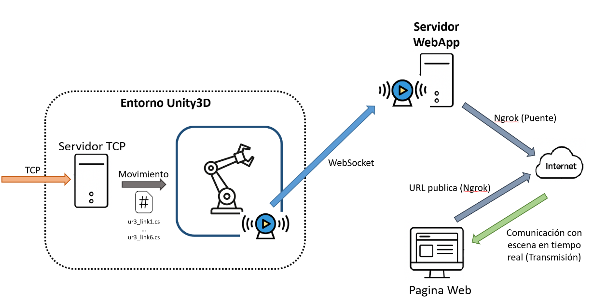

**6.1 Transmisión local de la escena de Unity3D**

Primero, descargar el archivo comprimo **UnityRenderStreaming-main.zip** del siguiente sitio <https://github.com/Unity-Technologies/UnityRenderStreaming>. Posteriormente, crea una carpeta llamada **Streaming** y descomprime en ese directorio el archivo.zip, este contendrá el servidor **WebApp** que recibe la trasmisión de la escena de Unity3D

Luego, abre el proyecto base de Unity3D y agregar Render Streaming desde Git URL. Para eso, en Unity, ve a: Window > Package Manager y en la parte superior izquierda, haz clic en el símbolo + y elige (Add package from Git URL…). Copia y pega este enlace:

<https://github.com/Unity-Technologies/UnityRenderStreaming.git?path=com.unity.renderstreaming>

Da clic en "Add". Esto va a instalar el paquete oficial **com.unity.renderstreaming** directamente desde GitHub, el cual contiene herramientas para exponer la escena de Unity3D hacia el exterior. Realizado lo anterior se deberá desplegar una ventana en al cual se dará “yes”. Unity se reiniciará automáticamente, habilitará los backends del nuevo Input System.

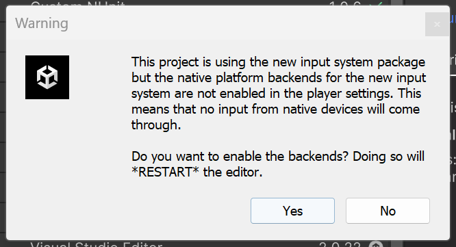

Después del reinicio, Unity te muestra errores y advertencias en la configuración del sistema para que Render Streaming funcione correctamente. Muchos de estos son detalles técnicos que pueden solucionarse automáticamente. Para ello Haz clic en Open Project Setting y marca la casilla **Automatic Streaming**, luego da clic en el botón “**Fix All**”

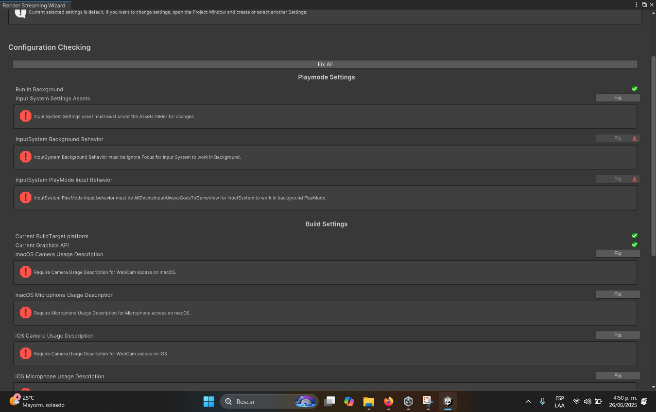
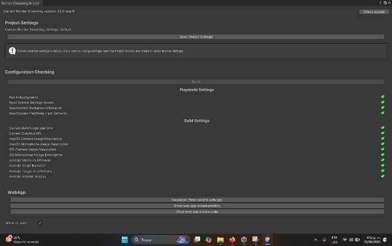

Posteriormente, en el proyecto base, ve a la venta **SampleScene** y da clic sobre **Main Camera** y ve al inspector, ahí da clic en “**Add Component**” y busca el script Video **Stream Sender**, este permite transmitir la señal de video hacia un receptor que en este caso es el servidor **WebApp**. Al usar este componte habrá una sección llamada camera, arrastra el objeto Main Camera hacia esta sección.

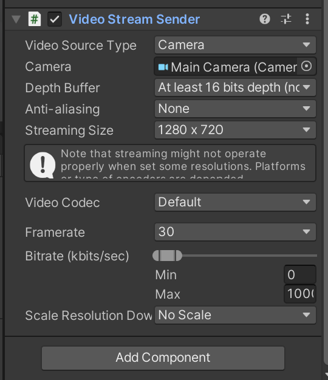

Ahora se abre terminal(cmd) e ingresa al director Streaming donde debe estar la carpeta UnityRenderStreaming-main que se obtuvo de descomprimir el archivo.zip. entra al directorio UnityRenderStreaming-main y luego al servidor Web App. Una vez se ingrese al directorio WebApp ejecuta uno por uno los comandos:

- **npm install**
- **npm run build**
- **npm run start**

Lo anterior, instala, compila e inicializa el servidor WebApp.

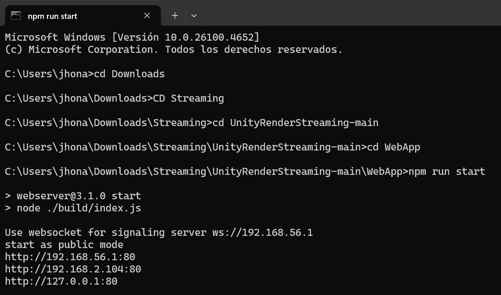

Al iniciar el servido WebApp, este recibe le señal de video transmitida desde unity3D, paso siguiente, compila el proyecto base este deberá mostrar en consola los siguientes mensajes:

**Signaling: Connecting WS ws://127.0.0.1:80**

**Signaling: WS connected.**

Lo que signifiac que se conectó al servidor WebApp y transmite la señal en **<http://127.0.0.1:80>**. Al ingresa a ese link, da clic en **Receiver Sample** ahí observara la transmisión de la escena. Da clic en **play** luego ve a Unity3D y da clic en el boto de **pause**.

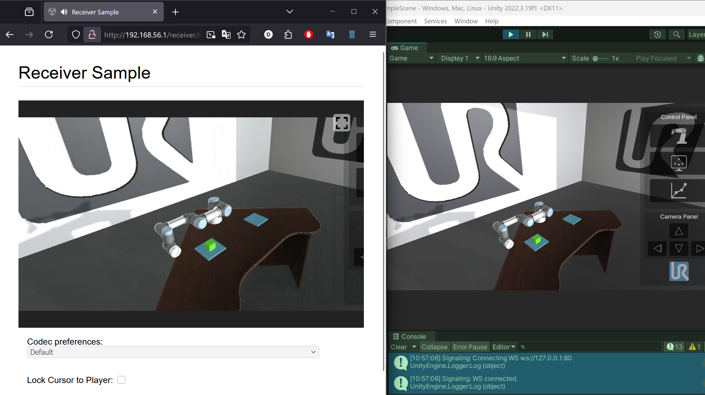

Hasta este punto se está transmitiendo la señal de forma local, lo que significa que solo los dispositivos conectados a la misma red del pc donde esta Untiy3D puede mirar la transmisión.

**6.2 Transmisión publica de la escena de Unity3D**

Para realizar la transmisión de la escena de Unity3D, usamos **ngrok** que es una aplicación multiplataforma que crea túneles seguros desde un punto final público a un servicio web local, lo que permite exponer servidores locales a internet

Primero, crea una cuenta en ngrok <https://ngrok.com/>. Realizado lo anterior, ingresa a <https://ngrok.com/downloads/windows?tab=download>, y descarga el ejecutable independiente. Crea una carpeta llamada **Ngrok** y descomprime el archivo **ngrok-v3-stable-windows-amd64.zip** en ese directorio, tendrás un archivo **ngrok.exe**.

Posteriormente, ingresa a la cuenta de **ngrok** que se creó anteriormente, en la parte lateral izquierda ve a la sección **Getting Started** y da clic en **Your Authtoken**. Copia la autorización de tu token (TU_TOKEN_DE \_AUROTIZACION)

Abre la terminal (CMD), navega hasta esa carpeta Ngrok donde pusiste el ngrok.exe, y desde ahí escribir los comandos:

ngrok config add-authtoken **TU_TOKEN_DE \_AUROTIZACION**

Una vez realizado lo anterior en el termina cmd debe salir:

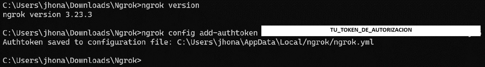

 Lo que significa que Ngrok ya quedó autenticado con tu cuenta correctamente.

Finalmente, en ese mismo directorio Ngrok (donde está el ngrok.exe) escribe el siguiente comando:

ngrok http 80

http 80 es debido a que el servidor WebApp está corriendo en el puerto 80, entonces ngrok lo que hace es exponer el puerto 80 en internet para que cualquiera pueda ver la escena de Unity3D. Ejecutado ese comando debe salir lo siguiente:

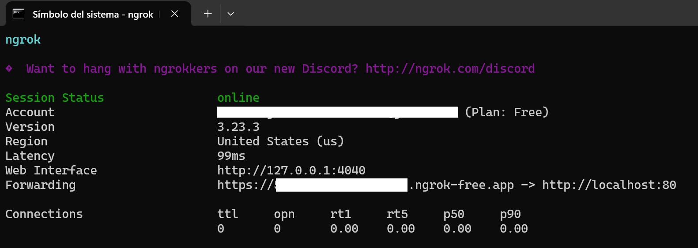

**Forwarding** es la ruta para exponer la escena de Uniy3D al público.

**6.3 Página Web HTML**

En el código de la Pagina Web anexa lo siguiente:

&lt;div class="video-box"&gt;

&nbsp;     &lt;h3&gt;Vista en Vivo Desde Unity (RenderStreaming)&lt;/h3&gt;

&nbsp;     <iframe src="<https://5b9-152-2e02-15-10.ngrok-free.app/receiver/index.html>"

&nbsp;             width="650"

&nbsp;             height="480"

&nbsp;             allowfullscreen>&lt;/iframe&gt;

&nbsp;   &lt;/div&gt;

Esto permite visualizar en la interfaz web la trasmisión del video. El link usado es el que **ngrok** dio. Sin embargo, para que acceda directo al video se de acceder a **Receiver Sample** y ese link usarlo en el código anterior.

Esta URL publica en el código html debe ser modificada cada vez que se cierre y abra nuevamente el servidor WebApp y la herramienta ngrok. Finalmente, se obtiene un sistema de comunicación IoT como el indicado al inico de este documento.

# **Referencias.**

\[1\] Arduino, "Arduino Libraries," Arduino Documentation, \[Online\]. Available: <https://docs.arduino.cc/libraries/>.

\[2\] Arduino Forum, "TCP/IP Socket Communication ESP32," Arduino Forum, \[Online\]. Available: <https://forum.arduino.cc/t/tcp-ip-socket-communication-esp32/>.

\[3\] Arduino, "Websockets Library," Arduino Documentation, \[Online\]. Available: <https://docs.arduino.cc/libraries/websockets/>.

\[4\] Random Nerd Tutorials, "ESP32 Projects and Tutorials," Random Nerd Tutorials, \[Online\]. Available: <https://randomnerdtutorials.com/projects-esp32/>.

\[5\] Random Nerd Tutorials, "ESP32 WebSocket Server: Display Sensor Readings in Real Time," Random Nerd Tutorials, \[Online\]. Available: <https://randomnerdtutorials.com/esp32-websocket-server-sensor/>.

